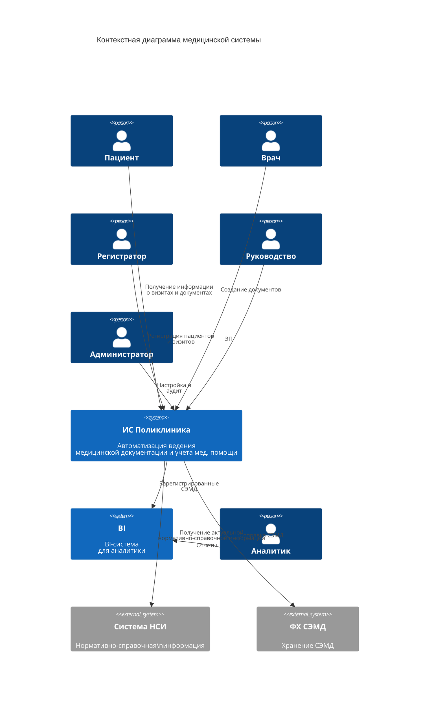

# 3.1 Общая схема

### Контекстная диаграмма

#### Описание

**Системы поликлиники**

* ИС Поликлиника - разрабатываемая система ведения медицинской документации
* &#x20;BI - внутренняя BI-система&#x20;

**Внешние системы**

* ФХ СЭМД - федеральное хранилище СЭМД
* Система НСИ - Система управления НСИ&#x20;

### Модули ИС Поликлиника

| Название модуля системы             | Описание модуля                                     |
| ----------------------------------- | --------------------------------------------------- |
| Сотрудники                          | Ведение карточек сотрудников                        |
| Пациенты                            | Ведение карточек пациентов                          |
| Тип документа                       | Типы медицинских документов                         |
| Документы                           | Ведение реестра медицинских документов              |
| СЭМД                                | Реестр сформированных СЭМД                          |
| Справочник адресов                  | Справочник адресов                                  |
| Справочник профилей мед.услуг       | Справочник профилей медицинских услуг               |
| Справочник организаций              | Справочник организаций                              |
| Справочник заболеваний и диагнозов  | Справочник заболеваний и диагнозов                  |
| Справочник лекарственных препаратов | Справочник лекарственных препаратов                 |
| Структура документов                | Настройка структуры документов по типам             |
| Шаблоны СЭМД                        | Настройка структуры СЭМД для медицинских документов |
| Настройки                           | Настройки                                           |
| Профиль пользователя                | Профиль пользователя                                |

### Основные сущности

#### 1. Пользователи и персонал

* Сотрудники - основная сущность для хранения информации о медицинском персонале (врачи, медсестры, администраторы)
* Профиль пользователя - персональные настройки и права доступа пользователей системы

#### 2. Пациенты и клиническая информация

* **Пациенты** - центральная сущность для хранения демографических и медицинских данных пациентов
* **Документы** - медицинские документы, связанные с пациентами и содержащие клиническую информацию
* **СЭМД** - структурированные электронные медицинские документы, соответствующие стандартам

#### 3. Справочники и классификаторы

* **Справочник адресов** - стандартизированные адресные данные
* **Справочник профилей мед.услуг** - каталог медицинских услуг и специальностей
* **Справочник организаций** - реестр медицинских организаций и учреждений
* **Справочник заболеваний и диагнозов** - классификатор болезней (МКБ-10/11)
* **Справочник лекарственных препаратов** - фармакологический справочник

#### 4. Конфигурация и шаблоны

* **Тип документа** - классификация медицинских документов по типам
* **Структура документов** - метаданные для определения полей и структуры документов
* **Шаблоны СЭМД** - предопределенные шаблоны для создания структурированных документов
* **Настройки** - системные параметры и конфигурация

### Связи между сущностями

#### Основные взаимосвязи:

1. **Сотрудники ↔ Документы** - один сотрудник может создавать множество документов
2. **Пациенты ↔ Документы** - один пациент может иметь множество медицинских документов
3. **Документы ↔ Тип документа** - каждый документ относится к определенному типу
4. **Документы ↔ СЭМД** - документы могут быть преобразованы в структурированные СЭМД
5. **Тип документа ↔ Структура документов** - каждый тип имеет определенную структуру
6. **СЭМД ↔ Шаблоны СЭМД** - СЭМД создаются на основе шаблонов

#### Справочные связи:

* **Пациенты** → **Справочник адресов**
* **Сотрудники** → **Справочник организаций**
* **Документы** → **Справочник заболеваний и диагнозов**
* **Документы** → **Справочник лекарственных препаратов**
* **Сотрудники** → **Справочник профилей мед.услуг**

### Иерархия доступа

#### Уровни доступа:

1. **Системный уровень** - Настройки, справочники
2. **Организационный уровень** - Сотрудники, структуры документов
3. **Клинический уровень** - Пациенты, документы, СЭМД
4. **Пользовательский уровень** - Профили пользователей

### Ключевые атрибуты сущностей

#### Общие атрибуты для всех сущностей:

* ID (уникальный идентификатор)
* Дата создания
* Дата последнего изменения
* Пользователь, создавший запись
* Статус записи (активная/неактивная)

#### Специфические атрибуты:

* **Пациенты**: ФИО, дата рождения, пол, контакты, полис ОМС
* **Сотрудники**: ФИО, должность, специализация, СНИЛС
* **Документы**: номер, дата, тип, содержание, статус
* **СЭМД**: версия стандарта, схема валидации, статус подписи

### Принципы модели

1. **Нормализация** - устранение дублирования данных через справочники
2. **Масштабируемость** - возможность расширения без нарушения существующих связей
3. **Безопасность** - контроль доступа на уровне сущностей и атрибутов
4. **Аудит** - отслеживание изменений критически важных данных
5. **Интеграция** - совместимость со стандартами медицинской информатизации

