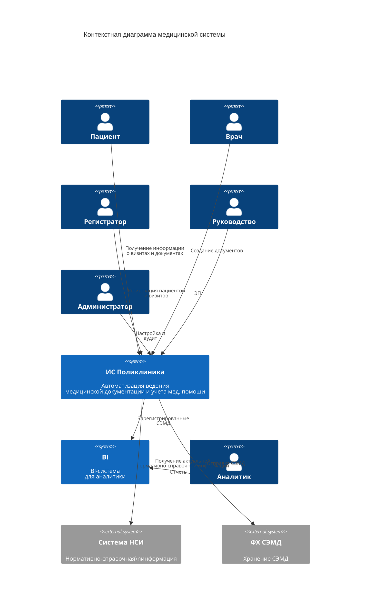

# 3.1 Общая схема

### Контекстная диаграмма

#### Описание

**Системы поликлиники**

* ИС Поликлиника - разрабатываемая система ведения медицинской документации
* &#x20;BI - внутренняя BI-система&#x20;

**Внешние системы**

* ФХ СЭМД - федеральное хранилище СЭМД
* Система НСИ - Система управления НСИ&#x20;

