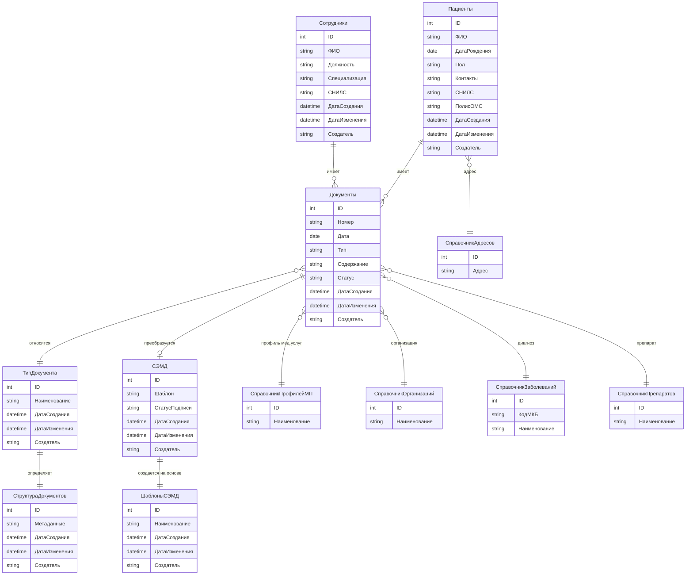

# 3.3 Сущностная модель

### ER-диаграмма

### Основные сущности

#### 1. Пользователи и персонал

* Сотрудники - основная сущность для хранения информации о медицинском персонале (врачи, регистраторы)
* Профиль пользователя - персональные настройки  пользователей системы

#### 2. Пациенты и клиническая информация

* Пациенты - центральная сущность для хранения данных пациентов
* Документы - медицинские документы, связанные с пациентами и содержащие клиническую информацию
* СЭМД - структурированные электронные медицинские документы, соответствующие стандартам

#### 3. Справочники и классификаторы

* Справочник адресов&#x20;
* Справочник профилей медицинской помощи&#x20;
* Справочник организаций&#x20;
* Справочник заболеваний и диагнозов&#x20;
* Справочник лекарственных препаратов&#x20;

#### 4. Конфигурация и шаблоны

* Тип документа - классификация медицинских документов по типам
* Структура документов - метаданные для определения полей и структуры документов
* Шаблоны СЭМД - предопределенные шаблоны для создания структурированных документов
* Настройки - системные параметры&#x20;

### Связи между сущностями

#### Основные взаимосвязи:

1. Сотрудники - Документы: один сотрудник может создавать множество документов
2. Пациенты - Документы: один пациент может иметь множество медицинских документов
3. Документы - Тип документа: каждый документ относится к определенному типу
4. Документы - СЭМД: документы могут быть преобразованы в структурированные СЭМД
5. Тип документа - Структура документов: каждый тип имеет определенную структуру
6. СЭМД - Шаблоны СЭМД: СЭМД создаются на основе шаблонов

#### Справочные связи:

* Пациенты → Справочник адресов
* Документы → Справочник организаций
* Документы → Справочник заболеваний и диагнозов
* Документы → Справочник лекарственных препаратов
* Документы → Справочник профилей мед.услуг

### Ключевые атрибуты сущностей

#### Общие атрибуты для всех сущностей:

* ID&#x20;
* Дата создания
* Дата последнего изменения
* Пользователь, создавший запись

#### Специфические атрибуты:

* Пациенты: ФИО, дата рождения, пол, контакты, СНИЛС, полис ОМС
* Сотрудники: ФИО, должность, специализация, СНИЛС
* Документы: номер, дата, тип, содержание, статус
* СЭМД: шаблон СЭМД, статус подписи
