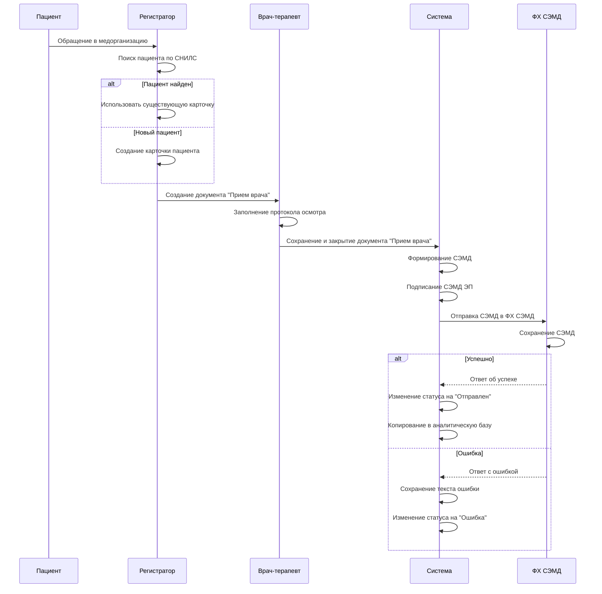

# 3.4 Базовый процесс

### Прием пациента, оформление медицинской документации и отправка СЭМД

```mermaid
sequenceDiagram
    participant P as Пациент
    participant R as Регистратор
    participant D as Врач-терапевт
    participant S as Система
    participant F as ФХ СЭМД

    P->>R: Обращение в медорганизацию
    R->>R: Поиск пациента по СНИЛС
    alt Пациент найден
        R->>R: Использовать существующую карточку
    else Новый пациент
        R->>R: Создание карточки пациента
    end
    R->>D: Создание документа "Прием врача"

    D->>D: Заполнение протокола осмотра
    D->>S: Сохранение и закрытие документа "Прием врача"

    S->>S: Формирование СЭМД
    S->>S: Подписание СЭМД ЭП
    S->>F: Отправка СЭМД в ФХ СЭМД

    F->>F: Сохранение СЭМД
    alt Успешно
        F-->>S: Ответ об успехе
        S->>S: Изменение статуса на "Отправлен"
        S->>S: Копирование в аналитическую базу
    else Ошибка
        F-->>S: Ответ с ошибкой
        S->>S: Сохранение текста ошибки
        S->>S: Изменение статуса на "Ошибка"
    end

```
