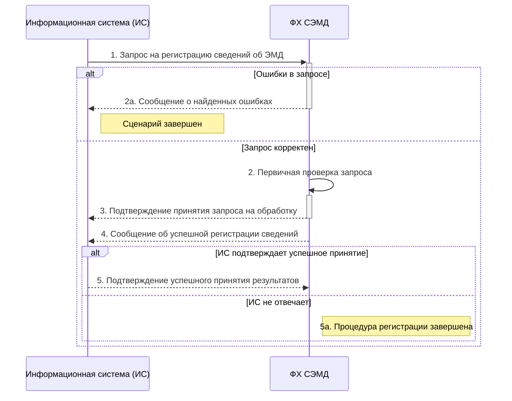

# 5.1 Интеграция REST

```mermaid
sequenceDiagram
    participant ИС as Информационная система (ИС)
    participant ФХ as ФХ СЭМД

    %% Основной сценарий (зелёные стрелки)
    ИС->>+ФХ: 1. Запрос на регистрацию сведений об ЭМД
    alt Ошибки в запросе
        %% Альтернативный сценарий (красные стрелки)
        ФХ-->>-ИС: 2a. Сообщение о найденных ошибках
        note right of ИС: Сценарий завершен
    else Запрос корректен
        ФХ->>+ФХ: 2. Первичная проверка запроса
        ФХ-->>-ИС: 3. Подтверждение принятия запроса на обработку
        ФХ-->>ИС: 4. Сообщение об успешной регистрации сведений
        alt ИС подтверждает успешное принятие
            ИС-->>ФХ: 5. Подтверждение успешного принятия результатов
        else ИС не отвечает
            note right of ФХ: 5a. Процедура регистрации завершена
        end
    end

```
